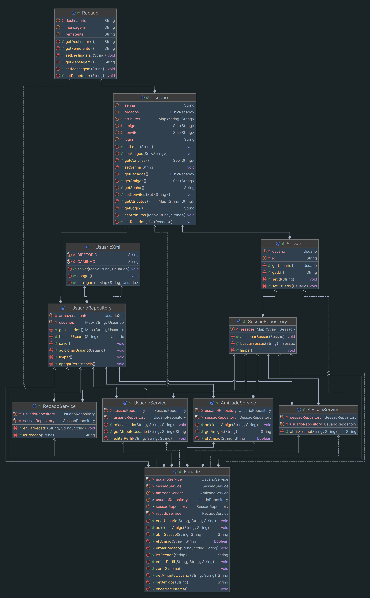

# Jackut

[Relatório Milestone 1 - PDF](relatorio-milestone1.pdf)

Projeto da disciplina Programação 2 (COMP372) 2026.1 - UFAL desenvolvido em Java.

## Estrutura

```text
Jackut/
+-- lib/
|   +-- easyaccept.jar              - Biblioteca EasyAccept
+-- tests/                          - Testes de aceitação
+-- data/                           - Dados persistidos em XML
+-- src/br/ufal/ic/jackut/
    +-- Main.java                   - Ponto de entrada dos testes
    +-- Facade.java                 - Interface pública do sistema
    +-- model/                      - Entidades do domínio
    +-- service/                    - Regras de negócio
    +-- repository/                 - Armazenamento e consulta de dados
    +-- exception/                  - Exceções de domínio
```

O Jackut foi separado em camadas para manter a lógica de negócio isolada da interface de testes:

**Camada de Interface:** `br.ufal.ic.jackut.Facade`. Expõe os métodos esperados pelo EasyAccept e delega as operações para os serviços responsáveis.

**Camada de Regras de Negócio:** `br.ufal.ic.jackut.service`. Contém os serviços que implementam as regras de usuários, sessões, amizades e recados.

**Camada de Modelo:** `br.ufal.ic.jackut.model`. Representa as principais entidades do sistema: `Usuario`, `Sessao` e `Recado`.

**Camada de Repositório e Persistência:** `br.ufal.ic.jackut.repository`. Mantém os dados em memória e persiste usuários em XML usando `XMLEncoder` e `XMLDecoder`.

O ponto de entrada `Main` executa os scripts do EasyAccept, apontando para a `Facade` como classe de acesso ao sistema.

## Funcionalidades do milestone 1

- Criação de conta
- Abertura de sessão
- Criação e edição de perfil
- Adição de amigos
- Envio e leitura de recados

## Principais componentes e interações

### Diagrama



### Main

Executa os testes de aceitação do EasyAccept.

### Facade

A `Facade` instância os repositórios e serviços usados pelo sistema:

- `UsuarioRepository`
- `SessaoRepository`


- `UsuarioService`
- `SessaoService`
- `AmizadeService`
- `RecadoService`

Ela é a única classe que os testes precisam conhecer.

A `Facade` também controla o ciclo do sistema:

- **`zerarSistema`**: limpa a memória e remove o arquivo XML.
- **`encerrarSistema`**: salva os usuários em XML.

### Services

- **`UsuarioService`**
  - Criação de usuários.
  - Consulta de atributos de perfil.
  - Edição de atributos a partir de uma sessão válida.

- **`SessaoService`**
  - Autenticação de usuário.
  - Criação de sessões.

- **`AmizadeService`**
  - Envio de convites de amizade.
  - Confirmação de amizade.
  - Consulta de amizade entre usuários.
  - Listagem de amigos.

- **`RecadoService`**
  - Envio de recados entre usuários.
  - Leitura do recado mais antigo.

### Repositories

- **`UsuarioRepository`**
  - Mantém os usuários em um `Map<String, Usuario>`.
  - Permite adicionar, buscar e limpar usuários.
  - Encaminha operações de salvar, carregar e apagar dados para `UsuarioXml`.

- **`SessaoRepository`**
  - Mantém sessões abertas em memória.
  - Usa um `Map<String, Sessao>` para localizar sessões pelo id.

- **`UsuarioXml`**
  - Salva os usuários em `data/usuario.xml`.
  - Carrega os usuários persistidos ao iniciar o repositório.
  - Usa `XMLEncoder` e `XMLDecoder`.

### Models

- **`Usuario`**
  - Representa uma conta do Jackut.
  - Possui login, senha, atributos de perfil, amigos, convites de amizade e recados recebidos.

- **`Sessao`**
  - Representa uma sessão aberta por um usuário autenticado.
  - Possui um id gerado por `UUID` e uma referência ao usuário da sessão.

- **`Recado`**
  - Representa um recado enviado entre usuários.
  - Possui remetente, destinatário e conteúdo da mensagem.

### Exceptions

As exceções para representar erros específicos.

## Padrões e escolhas de design

### Facade

O padrão Facade fornece uma interface única para as operações do sistema. Funcionando como uma "porta de entrada" para o sistema.

No projeto, esse padrão resolve a necessidade de fornecer uma API simples para os testes do EasyAccept.

Com isso, os testes não precisam instanciar serviços, repositórios ou modelos. Eles interagem apenas com a `Facade`, enquanto a implementação real fica distribuída internamente.

Exemplo:

```java
public void criarUsuario(String login, String senha, String nome)
        throws ContaJaExisteException, SenhaInvalidaException, LoginInvalidoException {
    usuarioService.criarUsuario(login, senha, nome);
}
```

Nesse exemplo, a `Facade` recebe o comando externo e delega a criação de conta para `UsuarioService`, que contém a regra de negócio.

### Service Layer

O projeto usa uma camada de serviços para concentrar as regras de negócio. Essa escolha evita que a `Facade` ou outras classes fiquem responsáveis por diferentes funções.

Cada serviço possui uma responsabilidade clara:

- `UsuarioService` cuida de cadastro e perfil.
- `SessaoService` cuida de autenticação.
- `AmizadeService` cuida dos relacionamentos de amizade.
- `RecadoService` cuida da troca de mensagens.

Essa divisão facilita a manutenção, compreensão do projeto e reutilização de código, porque novas user stories podem ser adicionadas em serviços próprios ou em serviços já relacionados ao domínio da funcionalidade.

### Repository

Os repositórios isolam como os dados são guardados e recuperados. As classes de serviço não precisam manipular diretamente arquivos XML nem conhecer detalhes de persistência.

Essa escolha também auxilia na manutenção e entendimento do código e projeto. 

`UsuarioRepository` oferece operações de consulta e alteração de usuários, enquanto `UsuarioXml` fica responsável pelo armazenamento em arquivo.

`SessaoRepository` mantém sessões apenas em memória.

Felipe Aragão
