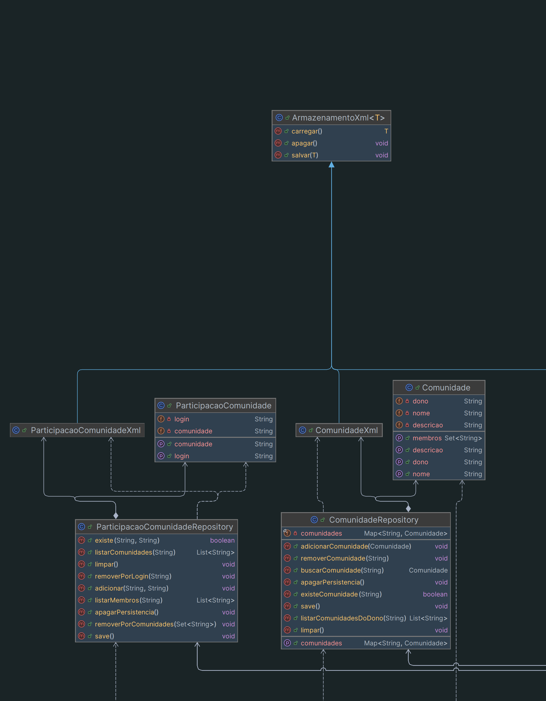
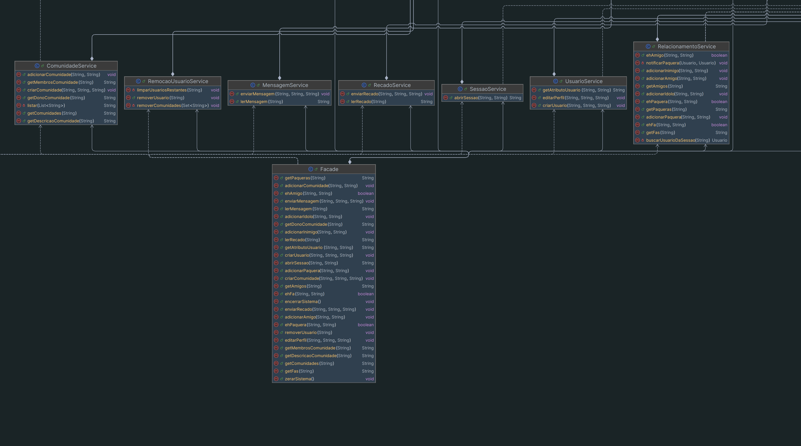
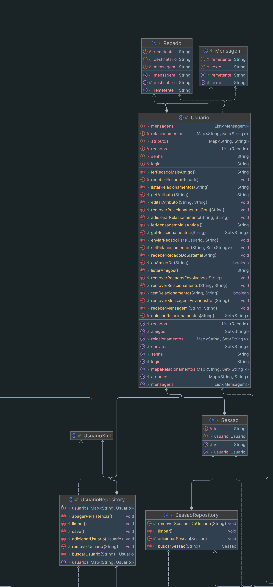
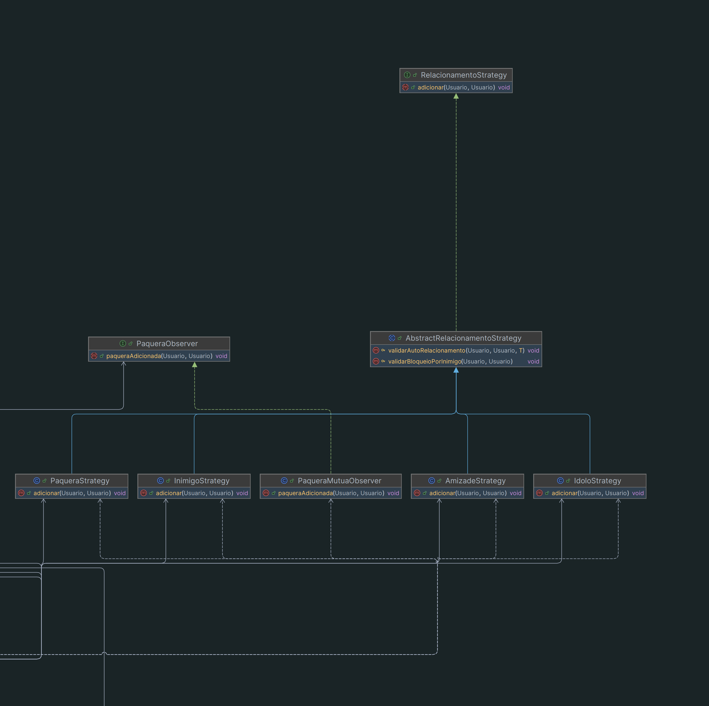

# Jackut

[Relatório Milestone 1 - PDF](relatorio-milestone1.pdf)

Projeto da disciplina Programação 2 (COMP372) 2026.1 - UFAL desenvolvido em Java.

[DOCUMENTAÇÃO](https://felipe-aragao.github.io/jackut/)

## Estrutura

```text
Jackut/
+-- lib/
|   +-- easyaccept.jar              - Biblioteca EasyAccept
+-- tests/                          - Testes de aceitação
+-- data/                           - Dados persistidos em XML
+-- docs/                           - Documentação Javadoc gerada
+-- src/br/ufal/ic/jackut/
    +-- Main.java                   - Ponto de entrada dos testes
    +-- Facade.java                 - Interface pública do sistema
    +-- model/                      - Entidades do domínio
    +-- service/                    - Regras de negócio
    |   +-- strategy/               - Estratégias de relacionamento
    |   +-- observer/               - Observadores
    +-- repository/                 - Armazenamento e consulta de dados
    +-- exception/                  - Exceções de domínio
```

O Jackut foi separado em camadas para manter a lógica de negócio isolada da interface de testes:

**Camada de Interface:** `br.ufal.ic.jackut.Facade`. Expõe os métodos esperados pelo EasyAccept e delega as operações para os serviços responsáveis.

**Camada de Regras de Negócio:** `br.ufal.ic.jackut.service`. Contém os serviços que implementam as regras de usuários, sessões, relacionamentos, recados, mensagens, comunidades e remoção de usuários.

**Camada de Modelo:** `br.ufal.ic.jackut.model`. Representa as entidades do sistema: `Usuario`, `Sessao`, `Recado`, `Mensagem`, `Comunidade` e `ParticipacaoComunidade`.

**Camada de Repositório e Persistência:** `br.ufal.ic.jackut.repository`. Mantém os dados em memória e persiste usuários, comunidades e participações em XML usando `XMLEncoder` e `XMLDecoder`.

O ponto de entrada `Main` executa os scripts do EasyAccept, apontando para a `Facade` como classe de acesso ao sistema.

## Funcionalidades

### Milestone 1

- Criação de conta
- Abertura de sessão
- Criação e edição de perfil
- Adição de amigos
- Envio e leitura de recados

### Milestone 2

- Relacionamentos de ídolos, fãs, paqueras e inimigos.
- Notificação de paquera.
- Criação e participação em comunidades.
- Envio de mensagens para membros de comunidades.
- Remoção de usuários.

## Principais componentes e interações

### Diagrama


---



---



---



---



### Main

Executa os testes de aceitação do EasyAccept.

### Facade

A `Facade` instancia os repositórios e serviços usados pelo sistema:

- `UsuarioRepository`
- `SessaoRepository`
- `ComunidadeRepository`
- `ParticipacaoComunidadeRepository`
- `UsuarioService`
- `SessaoService`
- `RelacionamentoService`
- `RecadoService`
- `MensagemService`
- `ComunidadeService`
- `RemocaoUsuarioService`

Ela é a única classe que os testes precisam conhecer.

A `Facade` também controla o ciclo do sistema:

- **`zerarSistema`**: limpa a memória e remove os arquivos XML.
- **`encerrarSistema`**: salva os usuários e comunidades em XML.

### Services

- **`UsuarioService`**
  - Criação de usuários.
  - Consulta de atributos de perfil.
  - Edição de atributos a partir de uma sessão válida.

- **`SessaoService`**
  - Autenticação de usuário.
  - Criação de sessões.

- **`RelacionamentoService`**
  - Relacionamentos de amizade, ídolos, fãs, paqueras e inimigos.
  - Notificação de paquera mútua usando observadores.

- **`RecadoService`**
  - Envio de recados entre usuários.
  - Leitura do recado mais antigo.
  - Bloqueio de recados inválidos

- **`ComunidadeService`**
  - Criação de comunidades.
  - Consulta de descrição, dono e membros.
  - Entrada de usuários em comunidades.
  - Listagem de comunidades de um usuário.

- **`MensagemService`**
  - Envio de mensagens para todos os membros de uma comunidade.
  - Leitura da mensagem mais antiga recebida por um usuário.

- **`RemocaoUsuarioService`**
  - Remoção de usuários.
  - Limpeza de vínculos do usuário removido em relacionamentos, recados, mensagens, sessões, comunidades e participações.

### Repositories

- **`UsuarioRepository`**
  - Mantém os usuários em um `Map<String, Usuario>`.
  - Permite adicionar, buscar, remover e limpar usuários.
  - Encaminha operações de salvar, carregar e apagar dados para `UsuarioXml`.

- **`SessaoRepository`**
  - Mantém sessões abertas em memória.
  - Usa um `Map<String, Sessao>` para localizar sessões pelo id.
  - Remove sessões associadas a um usuário.

- **`ComunidadeRepository`**
  - Mantém comunidades em um `Map<String, Comunidade>`.
  - Permite adicionar, buscar, remover, listar comunidades por dono e persistir dados.
  - Encaminha a persistência para `ComunidadeXml`.

- **`ParticipacaoComunidadeRepository`**
  - Mantém os vínculos entre usuários e comunidades.
  - Lista membros de uma comunidade e comunidades de um usuário.
  - Encaminha a persistência para `ParticipacaoComunidadeXml`.

- **`ArmazenamentoXml`**
  - Classe genérica para salvar, carregar e apagar dados XML dentro de `data/`.
  - É reutilizada por `UsuarioXml`, `ComunidadeXml` e `ParticipacaoComunidadeXml`.

### Models

- **`Usuario`**
  - Representa uma conta do Jackut.
  - Possui login, senha, atributos de perfil, relacionamentos, recados recebidos e mensagens recebidas.

- **`Sessao`**
  - Representa uma sessão aberta por um usuário autenticado.
  - Possui um id gerado por `UUID` e uma referência ao usuário da sessão.

- **`Recado`**
  - Representa um recado enviado entre usuários.
  - Possui remetente, destinatário e conteúdo da mensagem.

- **`Mensagem`**
  - Representa uma mensagem enviada para uma comunidade.
  - Possui remetente e texto.

- **`Comunidade`**
  - Representa uma comunidade do Jackut.
  - Possui dono, nome e descrição.

- **`ParticipacaoComunidade`**
  - Representa o vínculo entre um usuário e uma comunidade.
  - Necessário para manter a ordem de entrada por usuário

### Exceptions

As exceções para representar erros específicos.

## Padrões e escolhas de design

### Facade

O padrão Facade fornece uma interface única para as operações do sistema. Funcionando como uma "porta de entrada" para o sistema.

No projeto, esse padrão resolve a necessidade de fornecer uma API simples para os testes do EasyAccept.

Com isso, os testes não precisam instanciar serviços, repositórios ou modelos. Eles interagem apenas com a `Facade`, enquanto a implementação real fica distribuída internamente.

Exemplo:

```java
public void criarUsuario(String login, String senha, String nome)
        throws ContaJaExisteException, SenhaInvalidaException, LoginInvalidoException {
    usuarioService.criarUsuario(login, senha, nome);
}
```

Nesse exemplo, a `Facade` recebe o comando externo e delega a criação de conta para `UsuarioService`, que contém a regra de negócio.

### Service Layer

O projeto usa uma camada de serviços para concentrar as regras de negócio. Essa escolha evita que a `Facade` ou os modelos acumulem responsabilidades de diferentes partes.

Cada serviço possui uma responsabilidade clara:

- `UsuarioService` cuida de cadastro e perfil.
- `SessaoService` cuida de autenticação.
- `RelacionamentoService` cuida de amizades, ídolos, fãs, paqueras e inimigos.
- `RecadoService` cuida da troca de recados.
- `ComunidadeService` cuida de comunidades e seus membros.
- `MensagemService` cuida da troca de mensagens em comunidades.
- `RemocaoUsuarioService` cuida da exclusão de usuários e da limpeza dos dados associados.

Essa divisão facilita a manutenção, compreensão do projeto e reutilização de código, porque novas user stories podem ser adicionadas em serviços próprios ou em serviços já relacionados ao domínio da funcionalidade.

### Strategy

Os relacionamentos usam estratégias para isolar as regras de cada tipo de vínculo.

- `AmizadeStrategy`
- `IdoloStrategy`
- `PaqueraStrategy`
- `InimigoStrategy`

Todas seguem a interface `RelacionamentoStrategy`, com comportamento comum concentrado em `AbstractRelacionamentoStrategy`.

Esse padrão foi usado porque amizade, ídolo, paquera e inimigo têm a mesma intenção geral, adicionar um relacionamento, mas cada um possui validações e efeitos próprios. Com Strategy, cada regra fica em uma classe separada e o serviço não precisa concentrar todos os `ifs` desses casos.

### Observer

O fluxo de paquera usa observadores para reagir a eventos do domínio. Quando uma paquera é adicionada, `RelacionamentoService` notifica os observadores registrados. O `PaqueraMutuaObserver` identifica paquera mútua e envia um recado do sistema aos usuários envolvidos.

Esse padrão foi usado porque a paquera mútua é uma consequência de uma ação, não a ação principal. Com Observer, o serviço adiciona a paquera e delega a reação para uma classe própria, deixando o fluxo mais simples e facilitando a inclusão de possíveis novas reações no futuro, caso fosse um projeto real.

### Repository

Os repositórios isolam como os dados são guardados e recuperados. As classes de serviço não precisam manipular diretamente arquivos XML nem conhecer detalhes de persistência.

`UsuarioRepository`, `ComunidadeRepository` e `ParticipacaoComunidadeRepository` mantêm o estado em memória e delegam a persistência para classes especializadas em XML.

`SessaoRepository` mantém sessões apenas em memória, pois sessões não são persistidas entre execuções.

Felipe Aragão
